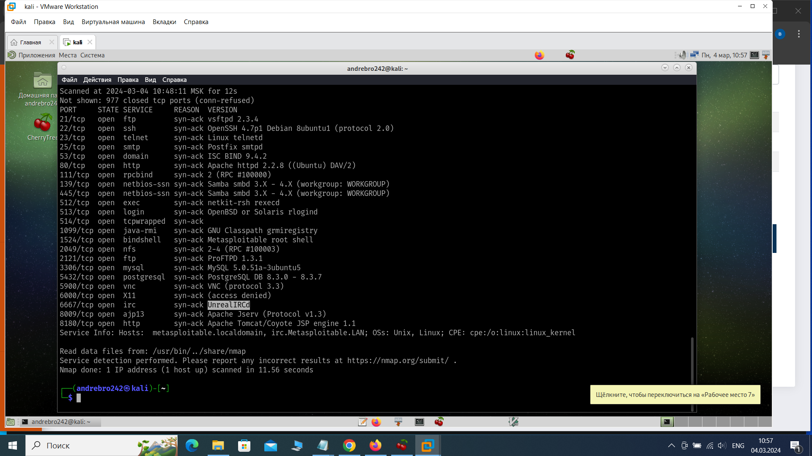
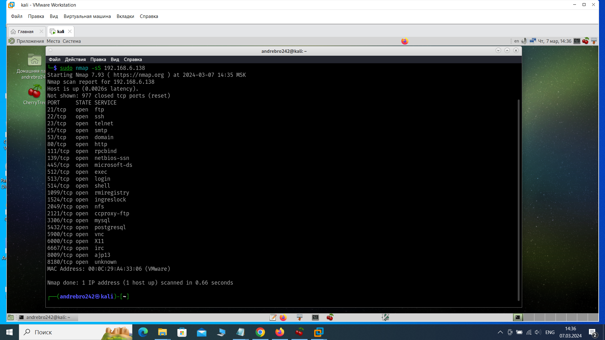
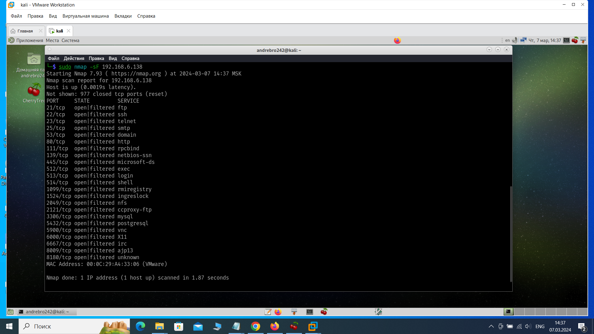
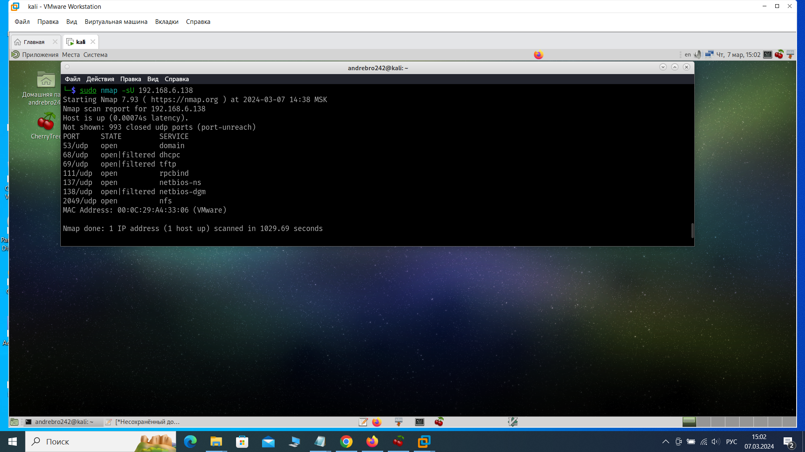
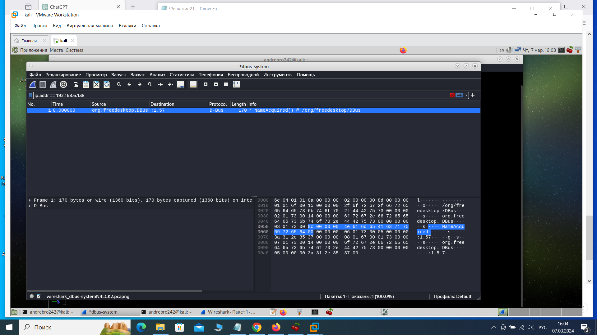
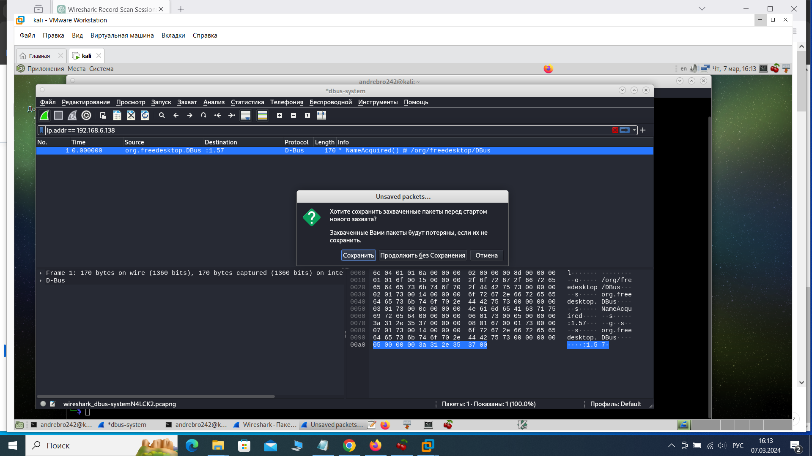

Домашнее задание к занятию «Уязвимости и атаки на информационные системы» Брюхов А SYS-26

Задание 1
Скачайте и установите виртуальную машину Metasploitable: https://sourceforge.net/projects/metasploitable/.

Это типовая ОС для экспериментов в области информационной безопасности, с которой следует начать при анализе уязвимостей.

Просканируйте эту виртуальную машину, используя nmap.

Попробуйте найти уязвимости, которым подвержена эта виртуальная машина.

Сами уязвимости можно поискать на сайте https://www.exploit-db.com/.

Для этого нужно в поиске ввести название сетевой службы, обнаруженной на атакуемой машине, и выбрать подходящие по версии уязвимости.

Ответьте на следующие вопросы:

Какие сетевые службы в ней разрешены?
Какие уязвимости были вами обнаружены? (список со ссылками: достаточно трёх уязвимостей)
Приведите ответ в свободной форме.

Решение 1

 Разрешенные сетевые службы на виртуальной машине:

    FTP (vsftpd 2.3.4)
    SSH (OpenSSH 4.7p1 Debian 8ubuntu1)
    Telnet (Linux telnetd)
    SMTP (Postfix smtpd)
    DNS (ISC BIND 9.4.2)
    HTTP (Apache httpd 2.2.8)
    RPC (rpcbind)
    NetBIOS (Samba smbd 3.X - 4.X)
    Exec (netkit-rsh rexecd)
    Java RMI (GNU Classpath grmiregistry)
    NFS (RPC #100003)
    MySQL (MySQL 5.0.51a-3ubuntu5)
    PostgreSQL (PostgreSQL DB 8.3.0 - 8.3.7)
    VNC (VNC protocol 3.3)
    IRC (UnrealIRCd)
    Apache Jserv (Apache Jserv Protocol v1.3)
    Apache Tomcat/Coyote JSP engine 1.1

Обнаруженные уязвимости на машине:

Уязвимость CVE-2009-2629 в vsftpd 2.3.4:
   Ссылка: CVE-2009-2629 https://www.exploit-db.com/exploits/5720
Уязвимость CVE-2008-1657 в OpenSSH 4.7p1 Debian 8ubuntu1:
   Ссылка: CVE-2008-1657 https://www.exploit-db.com/exploits/5720
Уязвимость CVE-2010-3718 в Apache Tomcat 5.5:
   Ссылка: CVE-2010-3718 https://www.exploit-db.com/exploits/15285

Задание 2
Проведите сканирование Metasploitable в режимах SYN, FIN, Xmas, UDP.

Запишите сеансы сканирования в Wireshark.

Ответьте на следующие вопросы:

Чем отличаются эти режимы сканирования с точки зрения сетевого трафика?
Как отвечает сервер?
Приведите ответ в свободной форме.

Решение 2

2.1 Сканирование Metasploitable в режимах SYN, FIN, Xmas, UDP:

1.Для сканирования в режиме SYN, используем следующую команду:

    sudo nmap -sS 192.168.6.138

2.Для сканирования в режиме FIN, используем команду:

    sudo nmap -sF 192.168.6.138

3.Для сканирования в режиме Xmas, используем команду:

    sudo nmap -sX 192.168.6.138

4.Для сканирования портов UDP, используем команду:

    sudo nmap -sU 192.168.6.138

2.2 Запись сеансов сканирования в Wireshark.

1.Запускаем Wireshark

2.Выберем сетевой интерфейс

3.Нажимаем "Start" (зеленый треугольник) для начала захвата пакетов.

4.Запустим процесс сканирования или выполним другие действия, которые вы хотим записать.

5.Остановим захват трафика

6.Сохраним файл захвата

3. Ответы на вопросы   

SYN-сканирование: При использовании этого метода сканирования отправляется TCP-пакет с установкой флага SYN (synchronize) без завершения установления соединения. Если сервер отвечает пакетом с флагом SYN-ACK, то порт считается открытым.

FIN-сканирование: В этом случае отправляется пакет с установкой флага FIN (finish). Если порт закрыт, сервер должен ответить соединением RST (reset).

Xmas-сканирование: Этот метод сканирования отправляет пакет с установленными флагами FIN, PSH и URG. Если порт закрыт, и сервер правильно реагирует, то он должен отправить пустой пакет.

UDP-сканирование: В отличие от TCP, UDP - протокол без установления соединения. При UDP-сканировании отправляются UDP-пакеты и ожидается ответ от сервера. Если приходит ответ, то порт считается открытым.

